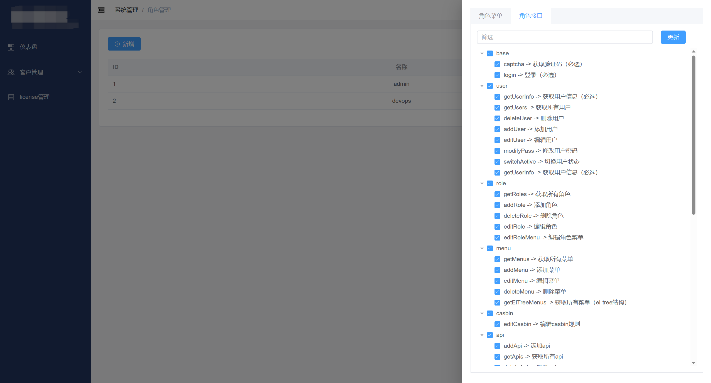

<h1 align="center" style="margin: 30px 0 30px; font-weight: bold;">Drawer</h1>
<h4 align="center">基于Gin+Vue3前后端分离的客户管理系统</h4>

## 平台简介

* 前端技术栈 TypeScript、Vue3、Element-Plus、Vite、Pinia
* 后端技术栈 Golang、Gin、Gorm、MySQL、Redis、Casbin

## 内置功能
### 基础功能
- 权限管理：基于`jwt`和`casbin`实现的权限管理。
- 用户管理：系统管理员分配用户角色和角色权限。
- 角色管理：创建权限控制的主要对象，可以给角色分配不同api权限和菜单权限。
- 菜单管理：实现用户动态菜单配置，实现不同角色不同菜单。
- api管理：不同用户可调用的api接口的权限不同。

### 平台功能
- 客户维保、环境及历史事件信息管理
- license的创建及详情管理
- 基于所有数据的数据分析

## 运行

默认账号密码

admin/123456


### 前端

```bash
# 配置
1. 一键安装 .vscode 目录中推荐的插件
2. node 版本 16+
3. pnpm 版本 8.x

# 进入项目目录
cd web

# 安装依赖
pnpm i

# 启动服务
pnpm dev

# 预览预发布环境
pnpm preview:stage

# 预览正式环境
pnpm preview:prod

# 构建预发布环境
pnpm build:stage

# 构建正式环境
pnpm build:prod

# 代码格式化
pnpm lint
```

### 后端

```bash
# 配置
1. Go >= 1.19

# 进入backend文件夹
cd backend

# 使用 go mod 并安装go依赖包
go generate

# 本地运行
go run main.go server
# 编译 
go build -o server main.go (windows编译命令为go build -o server.exe main.go )

# 运行二进制
./server (windows运行命令为 server.exe server)
```

## 构建
### 前端

```shell
$ cd web/
$ VERSION="1.0.0"
$ docker build -t drawer-web:${VERSION} .
```

### 后端
```shell
$ cd backend/
$ VERSION="1.0.0"
$ docker build -t drawer-backend:${VERSION} .
```

## 运行在docker环境中

### 后端
```shell
# 单机不用redis，可以不改redis相关的变量，但必须要有
docker run -itd -p 5558:5558 \
-e DRAWER_LOG_LEVEL="info" \
-e DRAWER_LOG_DIR="/data/drawer" \
-e DRAWER_MYSQL_NAME=drawer \
-e DRAWER_MYSQL_HOST=xxx.xxx.xxx.xxx \
-e DRAWER_MYSQL_PORT=3306 \
-e DRAWER_MYSQL_USER=xxxx \
-e DRAWER_MYSQL_PASS="xxxxxxx" \
-e DRAWER_REDIS_DB=0 \
-e DRAWER_REDIS_HOST=redis \
-e DRAWER_REDIS_PORT=6379 \
-e DRAWER_REDIS_PASS="" \
-e DRAWER_PORT='5558' \
-e DRAWER_LICENSE_API="https://xxx.xxx.xxx.xxx:xxxx/api/openapi/v1/generate" \
-e DRAWER_LICENSE_AUTH=true \
-e DRAWER_LICENSE_API_AUTH="xxxxxxx" \
-e DRAWER_SMTP_USER="xxxxxxxxxx" \
-e DRAWER_SMTP_PASS="xxxxxxxx" \
-e DRAWER_SMTP_SERVER="xxxxxxxxxxxx" \
-e DRAWER_SMTP_PORT=xxx \
-e DRAWER_SMTP_STARTTLS=true \
drawer-backend:1.0.0
```

### 前端
```shell
docker run -itd -p 8500:8500 \
-e DRAWER_BACKEND="xxx.xx.xx.xx:5558" \
drawer-web:1.0.0
```

## 项目预览图

<table>
  <tr>
    <td></td>
    <td></td>
  </tr>
  <tr>
    <td></td>
    <td></td>
  </tr>
  <tr>
    <td></td>
    <td></td>
  </tr>
  <tr>
    <td></td>
    <td></td>
  </tr>
  <tr>
    <td></td>
    <td></td>
  </tr>
  <tr>
    <td></td>
    <td></td>
  </tr>
</table>

## 参考项目

- [TD27-admin](https://github.com/pddzl/td27-admin)
- [v3-admin-vite](https://github.com/un-pany/v3-admin-vite)

## 参考文档
- [MarkDown编辑器](https://github.com/code-farmer-i/vue-markdown-editor)
- [vxe-table](https://vxetable.cn)
